# Modeles Avec Dessins

Ce document garde les modeles et ajoute directement le dessin sous chaque modele.
Tu peux copier-coller chaque section dans ton rapport.

## 1) Modele des cas d utilisation

### Description courte
Ce modele montre les acteurs (Etudiant, Enseignant, Admin) et les interactions principales avec la plateforme, GitHub, OAuth et CI/CD.

### Dessin
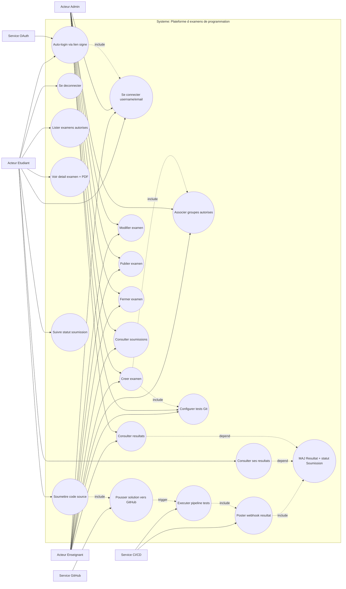

**Image PNG (pret a inserer):**  
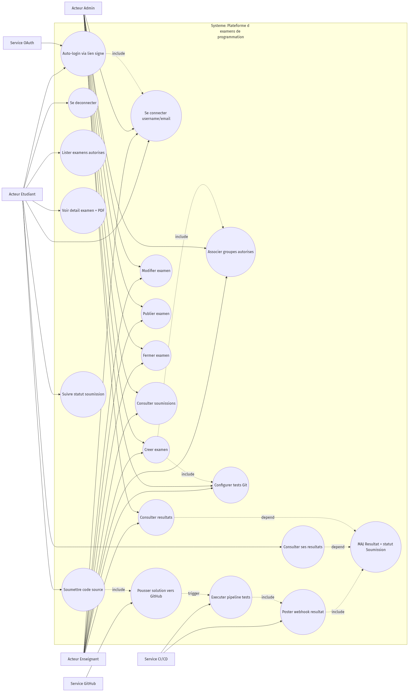

**Version vectorielle:** [use_cases.svg](./use_cases.svg)

## 2) MCD (modele conceptuel de donnees)

### Description courte
Le MCD presente les entites metier et leurs relations, sans details SQL.

### Dessin
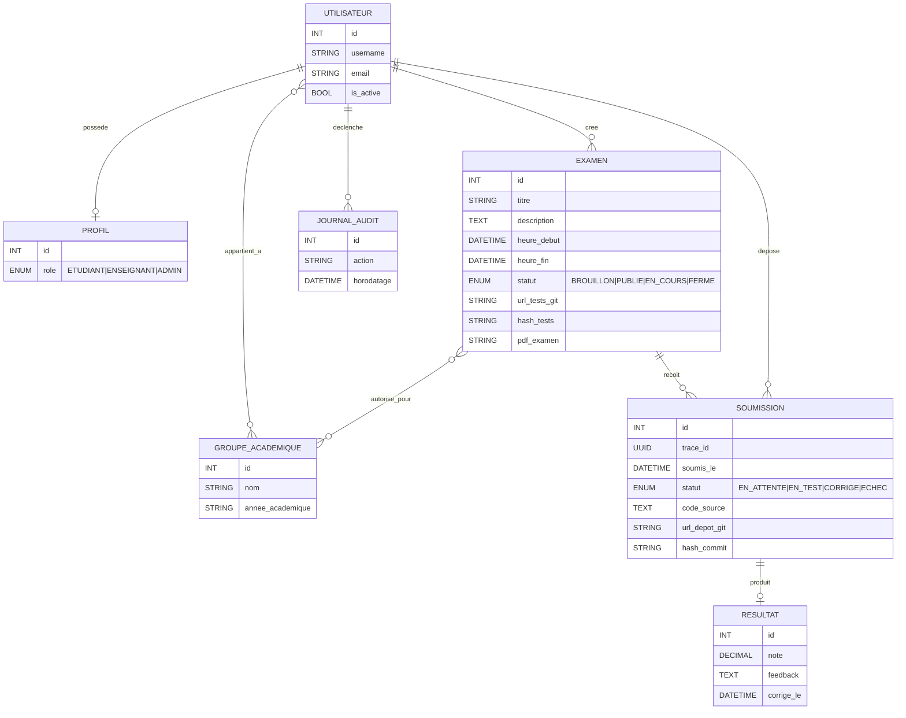

**Image PNG (pret a inserer):**  
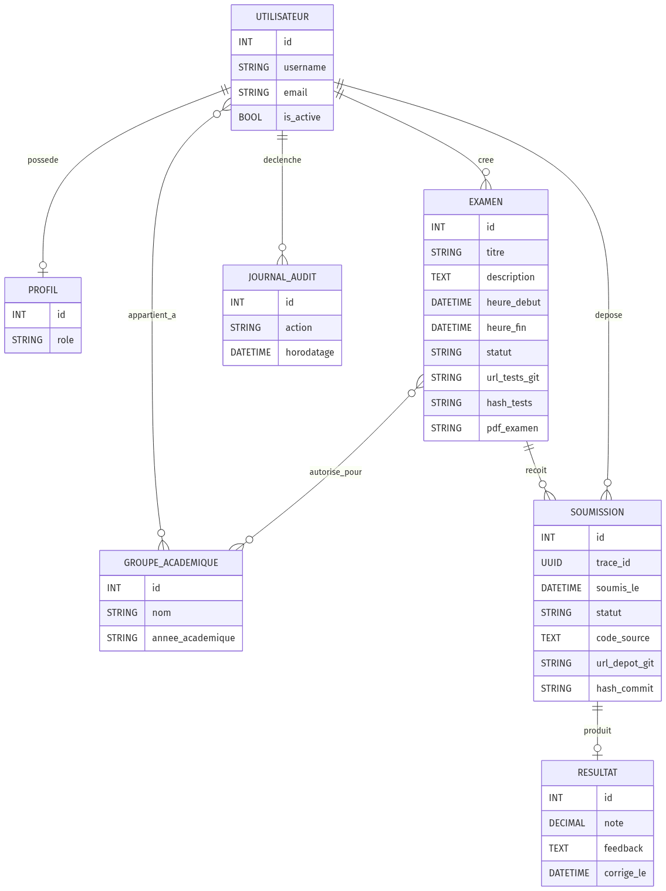

**Version vectorielle:** [mcd.svg](./mcd.svg)

## 3) MLD (modele logique de donnees)

### Description courte
Le MLD detaille les tables, cles primaires, cles etrangeres et contraintes.

### Dessin
```mermaid
erDiagram
    AUTH_USER {
        BIGINT id PK
        VARCHAR username UK
        VARCHAR email
        BOOLEAN is_active
        DATETIME last_login
        DATETIME date_joined
    }

    PROFIL {
        BIGINT id PK
        BIGINT utilisateur_id FK_UK
        ENUM role "ETUDIANT|ENSEIGNANT|ADMIN"
    }

    GROUPE_ACADEMIQUE {
        BIGINT id PK
        VARCHAR nom
        VARCHAR annee_academique
    }

    GROUPE_ACADEMIQUE_MEMBRES {
        BIGINT id PK
        BIGINT groupeacademique_id FK
        BIGINT user_id FK
    }

    EXAMEN {
        BIGINT id PK
        VARCHAR titre
        TEXT description
        DATETIME heure_debut
        DATETIME heure_fin
        ENUM statut "BROUILLON|PUBLIE|EN_COURS|FERME"
        BIGINT cree_par_id FK
        VARCHAR url_tests_git NULL
        CHAR hash_tests_40
        VARCHAR pdf_examen NULL
    }

    EXAMEN_GROUPES_AUTORISES {
        BIGINT id PK
        BIGINT examen_id FK
        BIGINT groupeacademique_id FK
    }

    SOUMISSION {
        BIGINT id PK
        UUID trace_id UK
        BIGINT examen_id FK
        BIGINT etudiant_id FK
        VARCHAR url_depot_git NULL
        VARCHAR hash_commit
        TEXT code_source
        DATETIME soumis_le
        ENUM statut "EN_ATTENTE|EN_TEST|CORRIGE|ECHEC"
    }

    RESULTAT {
        BIGINT id PK
        BIGINT soumission_id FK_UK
        DECIMAL note_5_2
        TEXT feedback
        DATETIME corrige_le
    }

    JOURNAL_AUDIT {
        BIGINT id PK
        BIGINT utilisateur_id FK_NULL
        VARCHAR action
        DATETIME horodatage
    }

    AUTH_USER ||--o| PROFIL : "profil applicatif"
    AUTH_USER ||--o{ GROUPE_ACADEMIQUE_MEMBRES : "membre"
    GROUPE_ACADEMIQUE ||--o{ GROUPE_ACADEMIQUE_MEMBRES : "contient"
    AUTH_USER ||--o{ EXAMEN : "cree"
    EXAMEN ||--o{ EXAMEN_GROUPES_AUTORISES : "autorise"
    GROUPE_ACADEMIQUE ||--o{ EXAMEN_GROUPES_AUTORISES : "est_cible"
    EXAMEN ||--o{ SOUMISSION : "recoit"
    AUTH_USER ||--o{ SOUMISSION : "depose"
    SOUMISSION ||--o| RESULTAT : "corrigee_par"
    AUTH_USER ||--o{ JOURNAL_AUDIT : "actions"
```

**Image PNG (pret a inserer):**  
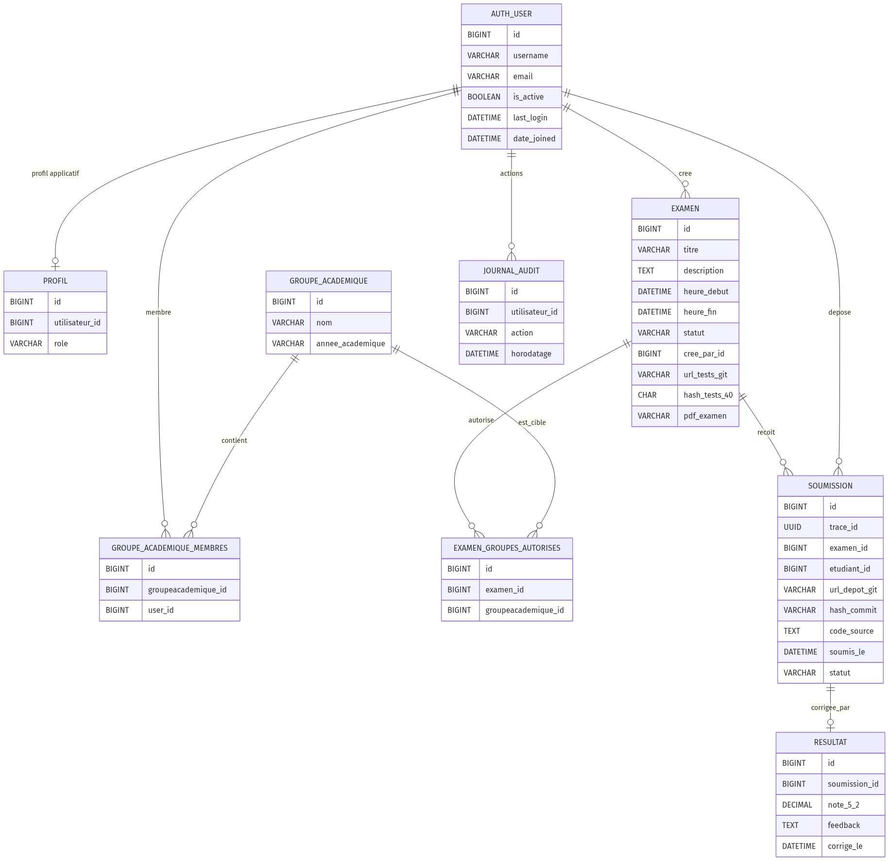

**Version vectorielle:** [mld.svg](./mld.svg)

## 4) Diagramme de classes

### Description courte
Ce diagramme relie classes metier (models), API (serializers/viewsets) et UI (forms).

### Dessin
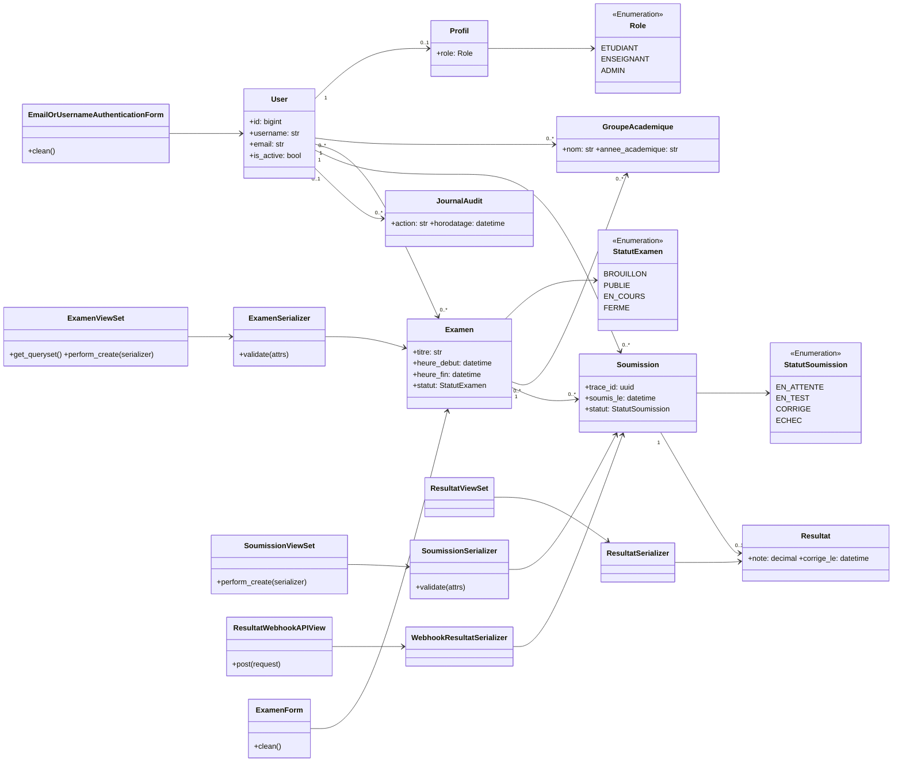

**Image PNG (pret a inserer):**  
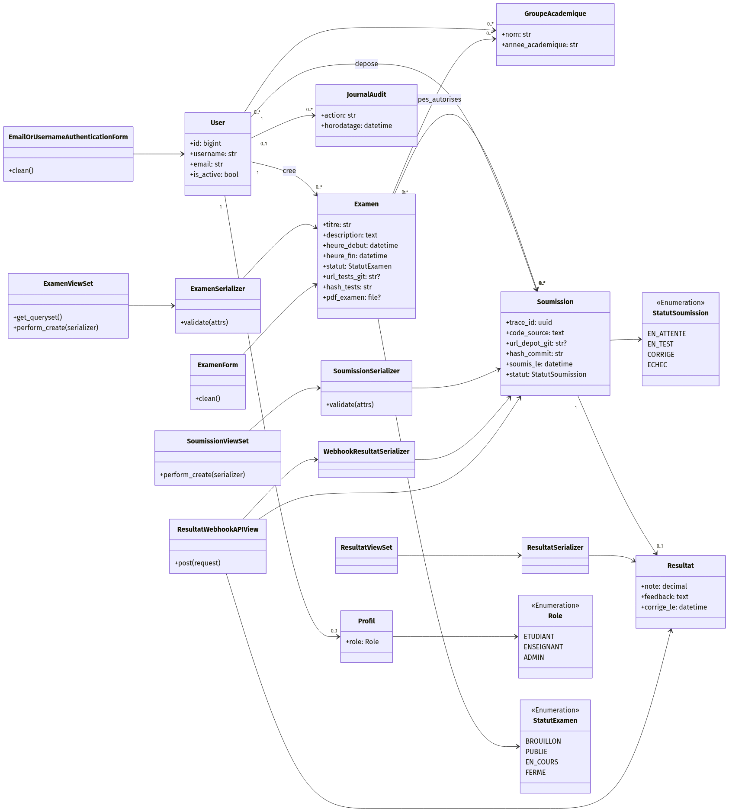

**Version vectorielle:** [class_diagram.svg](./class_diagram.svg)

## 5) Diagramme de sequence - cycle examen

### Description courte
Ce diagramme montre creation, validation, publication et suivi d un examen.

### Dessin
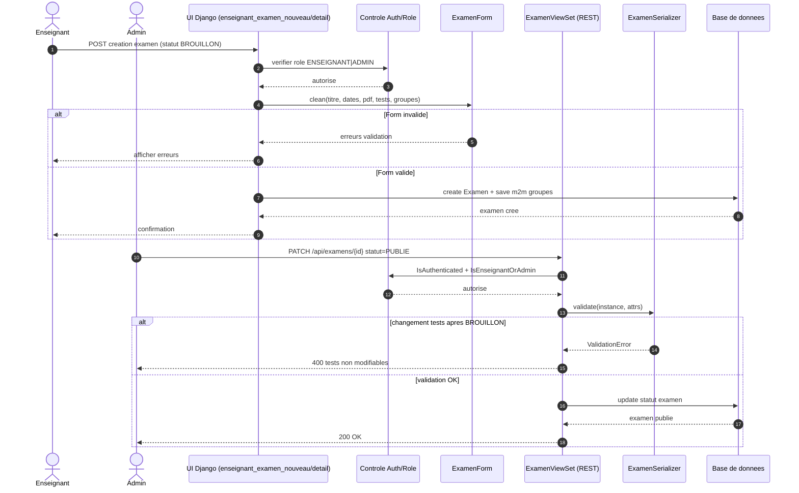

**Image PNG (pret a inserer):**  
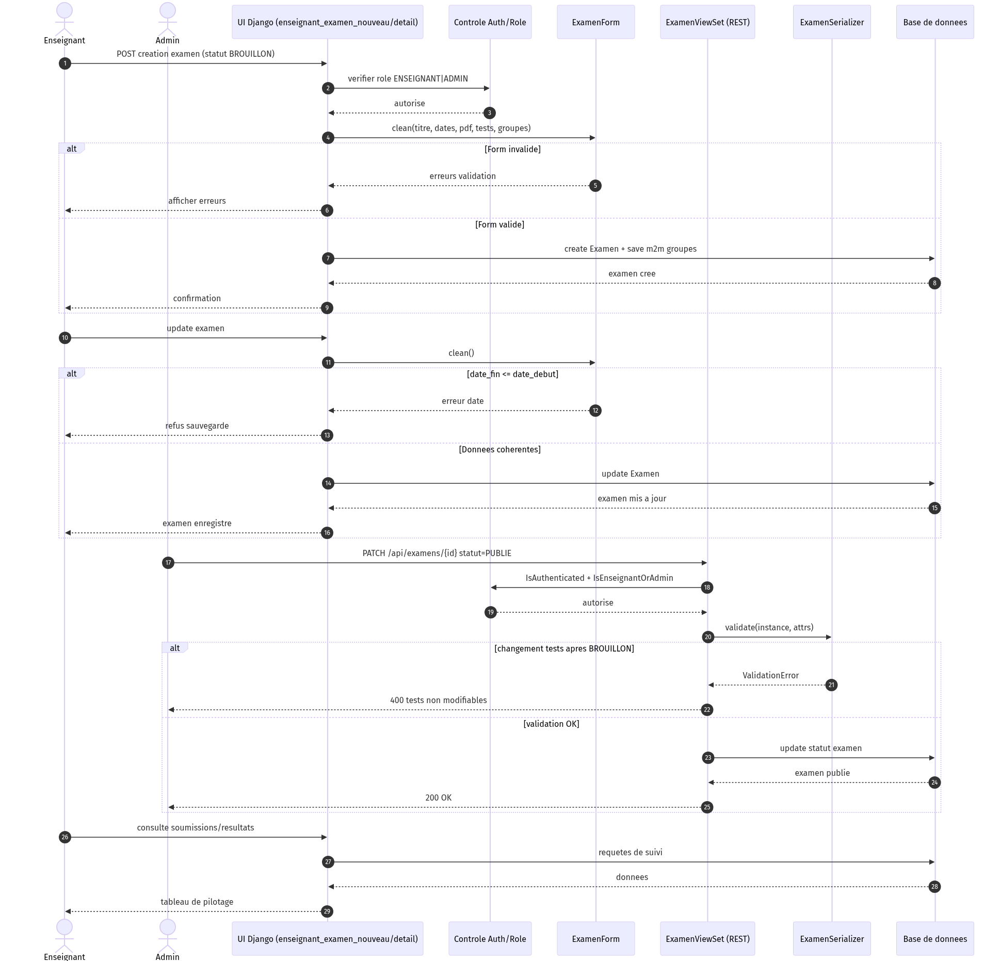

**Version vectorielle:** [sequence_exam_lifecycle.svg](./sequence_exam_lifecycle.svg)

## 6) Diagramme de sequence - soumission et correction

### Description courte
Ce diagramme couvre le flux complet de l etudiant vers CI/CD puis retour webhook.

### Dessin
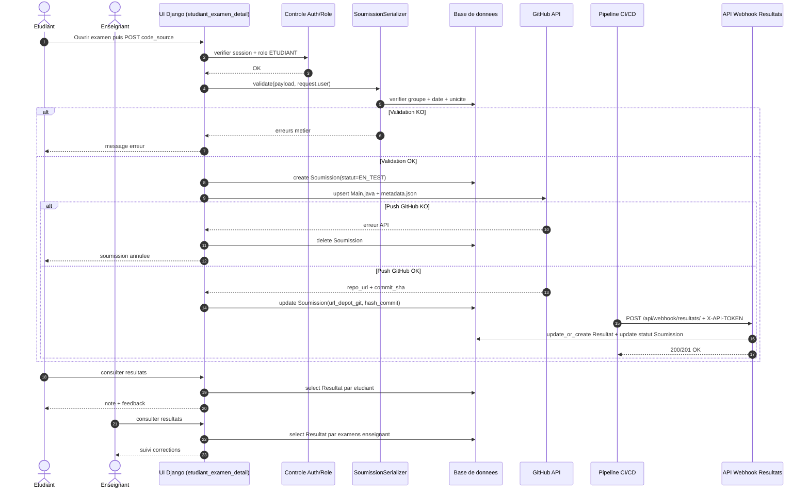

**Image PNG (pret a inserer):**  
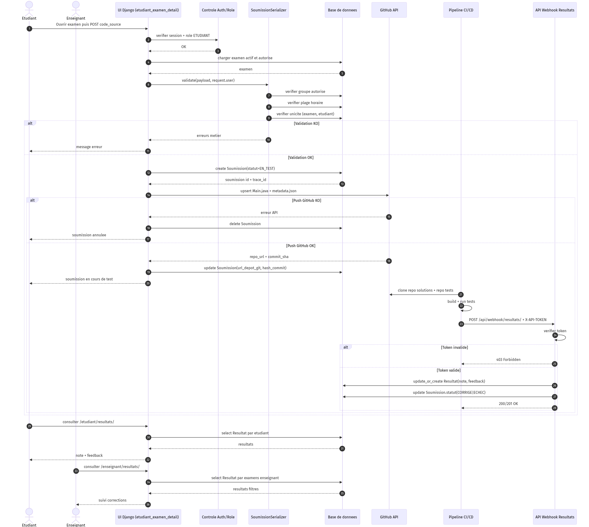

**Version vectorielle:** [sequence_submission_correction.svg](./sequence_submission_correction.svg)
